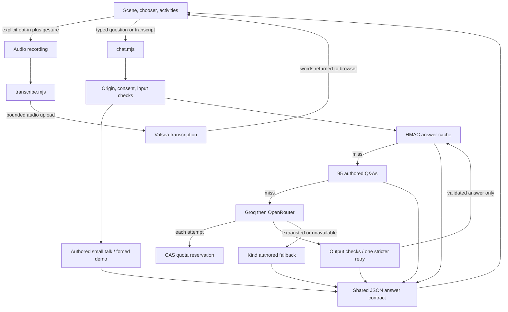

# Architecture

PokeLearn is a static learning scene with three server functions. The active repository is `dkrnr/pokelearnz`; development continues in `/performance/projects/dkrnr/pokelearnz`.

## Browser and build

`index.html`, `app.js`, `style.css`, `activities.js` and the local buddy catalogue implement the scene without a framework. State controls idle, recording, thinking, speaking and cancellation. The 1,025-buddy chooser uses a virtual list and cached CDN sprites; finite activities are authored locally.

`scripts/build.mjs` copies public files to `dist`, generates four HTML information pages through `scripts/static-pages.mjs`, emits metadata/robots/sitemap/JSON-LD and stamps the service-worker shell. esbuild minifies emitted JavaScript/CSS; source stays readable. `assets/social-card.png` and `docs/portfolio` screenshots were captured with Playwright.

## Functions and provider boundaries

- `transcribe.mjs`: strict origin and explicit consent, bounded audio type/size and Valsea timeout. Its returned transcript is checked before chat routing. Recording can contain background/private speech before text checks; this is disclosed.
- `chat.mjs`: strict origin and consent, input policy, authored small talk, optional forced demo, cache, authored bank and configured providers. Groq is tried before OpenRouter. An unavailable provider is skipped; exhausted routing returns a readable authored fallback. A detected OpenRouter daily limit skips the remaining free models and is remembered until the next UTC day.
- `health.mjs`: only key-presence booleans (`groq`, `openrouter`, `valsea`) and fixed health status; no credentials.
- `netlify/lib/providers`: a common adapter returns answer text or named errors. Groq uses its OpenAI-compatible endpoint; GPT-OSS uses strict answer-only JSON schema. OpenRouter uses explicit free model IDs. Classifier models/text and malformed envelopes fail closed.
- `child-safety.mjs` / `answer-contract.js`: input and output heuristics, PII screening, short English sentence limits and transport validation. Output has at most 180 characters and three sentences with at most eight words each. Greetings permit one narrow authored follow-up question. Fact checks cover selected known misconceptions, not all facts.

Provider calls are deadline bounded (14-second handler budget, four-second attempts, bounded model/retry lists). Each attempt reserves app quota. Output rejection allows one stricter retry; it does not silently display raw provider text. Stopping a request aborts browser work but cannot retract provider processing already started.

## Persistent data

`quota.mjs` provides Netlify Blobs compare-and-swap storage. Local tests use an explicit memory fixture; loopback development can use memory mode. Hosted quota-store failures fail closed to avoid uncontrolled model spending.

`answer-cache.mjs` uses the existing `pokelearn-ai-budget` store. Only general-science questions from a restricted vocabulary qualify; personal contexts and detected PII are excluded. Normalization folds case/whitespace/punctuation and removes an addressed buddy name. Factual buddy names remain distinct. Salted HMAC keys avoid storing raw questions. Entries contain validated answer, provider/model and expiry only. Capacity is 256 answers / 256 KiB. The default `CACHE_VERSION=2` excludes legacy 30-day entries; changing it invalidates all current entries. Answers shorter than 40 characters/eight words or containing uncertainty phrases are excluded on both reads and writes. Cached model answers are unverified. [Purge runbook](docs/CACHE.md). Answers stop serving at 24 hours; cleanup is lazy, so dormant records may remain longer. Store timeouts fail open for cache lookup, while quota remains fail closed.

The provider-state record contains only the OpenRouter next-reset timestamp. A warm-instance copy saves calls if persistence is unavailable. Quota records contain counts and daily salted IP hashes, not raw IPs. Concurrent writes use ETags; bounded retries avoid overwriting concurrent cache entries.

Device storage holds opt-in, language and optional buddy/recent choices. The public service-worker shell and visited sprite cache contain no conversations (sprite budget 12 MiB). App code does not persist raw audio, transcripts or question history. Cached answers can still be wrong, and heuristic PII checks are not a guarantee.

## Security and observation

The origin guard allows this site's production, strict Netlify branch/preview hosts and loopback development only. The public static server never serves `.env`, `.netlify` or repository files. `_headers` restricts scripts to self, CDN images/connect requests to jsDelivr, microphone to self, and allows only the Netlify dashboard iframe for the preview toolbar, denies framing the app itself, and denies camera and geolocation. JSON-LD is non-executable structured data.

Application telemetry is limited to stage, model ID, HTTP status, error code and latency. Platform/provider logs are governed separately. Grown-up-only debug shows source/model/error and the daily-limit reset on relevant responses; the child view gets readable captions.

[Privacy](PRIVACY.md) describes provider policies and retention. [Decisions](DECISIONS.md) explains trade-offs. [Release report](docs/redesign/STAGE-6-RELEASE.md) distinguishes local tests, deployed evidence and unverified work.
