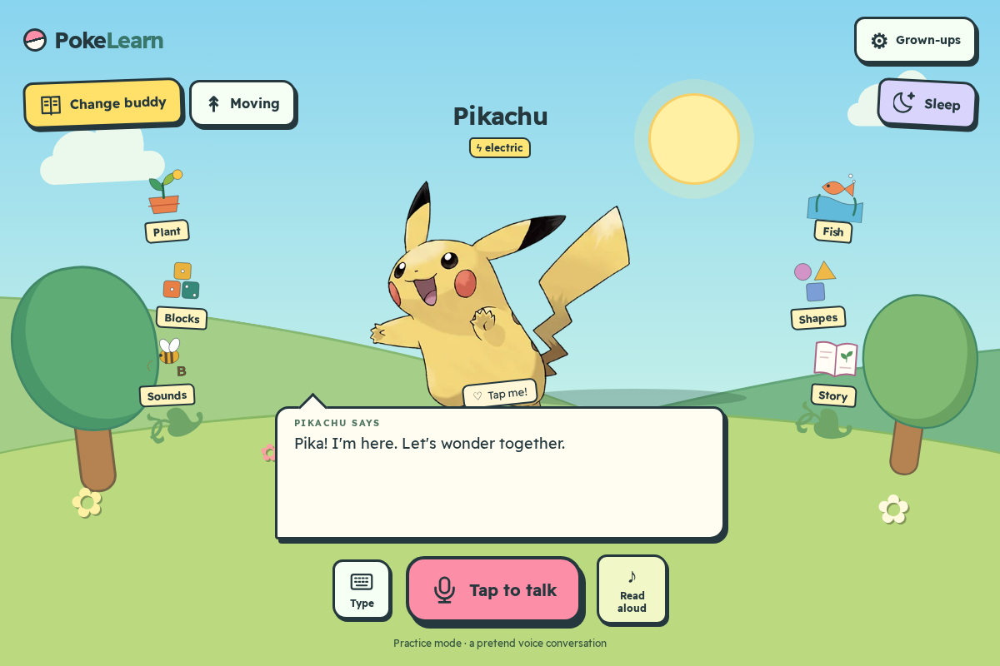
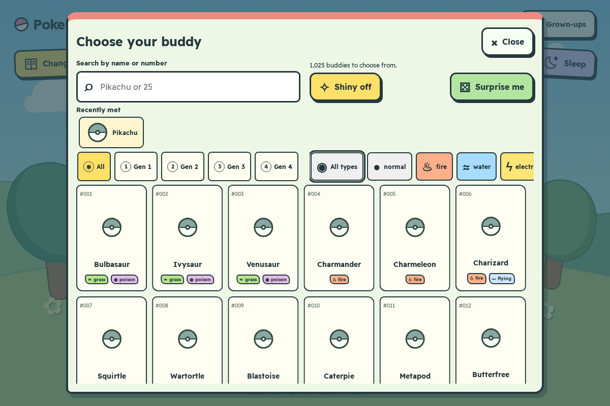
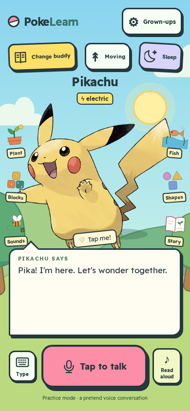
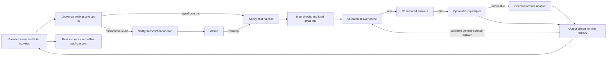

# PokeLearn

[](https://github.com/dkrnr/pokelearnz/actions/workflows/ci.yml)

A university project exploring calm, short learning moments for ages 6–9: a Pokémon buddy, six finite activities, captions and optional voice questions.



[Try the demo](https://pokelearnz.netlify.app/?demo=1) · [Parents](https://pokelearnz.netlify.app/parents) · [Privacy](https://pokelearnz.netlify.app/privacy) · [Project feedback](https://github.com/dkrnr/pokelearnz/issues)

This is an unofficial fan project and a university demo. Children should not enter personal information. It is not ready for public child use; human usability, language, provider terms and child-consent reviews remain open. Pokémon belongs to its respective owners.

## Problem and audience

A chat box can demand reading, produce long answers and encourage endless conversation. PokeLearn puts a familiar fictional buddy inside a quiet scene, with large controls, visible captions and six activities that end. The project explores accessibility and interaction design for children ages 6–9 and their grown-ups. It makes no measured learning-outcome or child-safety claim.

The chooser has a locally bundled catalogue of 1,025 buddies, generation and type filters, a virtual list, shiny variants and artwork fallback. The scene supports reduced motion, typing, optional device read-aloud, a quiet Sleep ending and cached offline activities. There are no ads, streaks, points, notifications or recurring engagement prompts.



<details><summary>Phone scene</summary>



</details>

These screenshots and the social card were made with Playwright from the mock scene; they contain no real child conversations.

## Architecture



Vanilla HTML/CSS/JavaScript, Node build scripts, Netlify Functions and Netlify Blobs; no UI framework. Build-time HTML supplies `/about`, `/parents`, `/privacy` and `/contact`, readable no-JS content, canonical metadata, social cards, a sitemap and family-friendly WebApplication JSON-LD. See [ARCHITECTURE.md](ARCHITECTURE.md) for the actual data boundaries.

## Decisions and trade-offs

- **Voice first, with typing and captions.** Voice can lower reading effort but introduces microphone permissions, background-speech privacy and recognition errors. Recording starts only after opt-in and a user gesture. Local device speech may be unavailable; captions remain.
- **Swappable providers.** An adapter isolates model payloads and errors. Groq adds independent capacity; OpenRouter free models share an account-wide daily quota. Missing keys skip a provider. The chain is cache → authored bank → Groq → OpenRouter → a kind fallback. Local small talk and forced demo mode precede this chain.
- **Restrictive safety checks.** Inputs and outputs are checked, classifier text is rejected, and answers have at most three short sentences. One stricter retry follows blocked output. These heuristics can miss unsafe content, reject harmless text and admit incorrect facts; they are not complete moderation.
- **Calm endings.** Finite activities and Sleep support stopping. No reward counters, streaks, automatic speech, ads or notification hooks are added. One short authored greeting question is allowed.
- **Privacy has limits.** Audio goes to Valsea. Unhandled questions go to Groq, then potentially OpenRouter and its model hosts. Free providers may retain or train on questions. A bounded answer cache stores validated, PII-screened general-science answers and HMAC keys; no question text is stored by application code. Provider/platform logs are separate. See [PRIVACY.md](PRIVACY.md), the built privacy page and [DECISIONS.md](DECISIONS.md).

## Run locally

Use the active checkout `/performance/projects/dkrnr/pokelearnz`; the previous checkout is a recovery copy. Node 22.12+ is required (CI uses Node 24).

```sh
npm ci
npx playwright install chromium
npm run build
npm start
```

Open `http://127.0.0.1:4178/?mock=1` for a provider-free mock scene. Activities work without model keys. `?demo=1` forces authored answers and shows a small Demo label in unlocked grown-up settings; microphone transcription still uploads to Valsea after consent.

For real local function calls, copy `.env.example` to ignored `.env` and provide server-only keys plus a private, stable `RATE_LIMIT_SALT` of at least 32 characters. Never put keys in public assets or Git. `GROQ_MODELS` selects explicit chat models (default `openai/gpt-oss-20b`); `OPENROUTER_MODELS` selects free IDs. `AI_PROVIDER` is retained for adapter compatibility; the normal handler uses the ordered configured chain. `AI_PRIVACY=account` inherits account policies; `strict` may leave no free OpenRouter endpoints. No account setting is changed by the app.

```sh
npm run check:models
npm run build
netlify dev --offline --no-open
```

Netlify CLI must be installed separately. Plain `npm start` also serves local functions; without keys it uses authored fallbacks. `LOCAL_AI_LIMITS=memory` is only for loopback development. Hosted functions use Netlify Blobs, fail closed if quota storage is unavailable, and bound provider attempts.

Contributors must run `git config core.hooksPath .githooks`. Set this checkout's approved identity locally before committing; the owner uses `Dunith Kerner <250664980+dkrnr@users.noreply.github.com>`. Hooks check effective identity and pushed history; the PR workflow checks author and committer emails against the explicit contributor allowlist.

## Testing and evidence

```sh
npm run build
npm run test:all
npm run lighthouse
```

The combined deterministic suite excludes live keys and does not load `.env`. It covers input/output policy, strict origins, server responses, small-talk regressions, all 95 authored answers, provider contracts, cache expiry/caps, UTC quota reset, gate auto-send, cancellation, activities, chooser filters, accessibility with axe, reduced motion, offline assets and service-worker update behavior. Fixture voice tests do not prove real recognition quality.

`npm run lighthouse` runs mobile audits for `/` and `/parents`, saves HTML/JSON under ignored `qa/artifacts/lighthouse`, and accepts an explicit base URL. Local scores describe a local build, not production latency. `npm run check:models` checks current model catalogs without an inference request.

A live gate is opt-in and consumes quota:

```sh
npm run test:live -- https://deploy-preview-24--pokelearnz.netlify.app/
```

It sends at most three synthetic questions, checks a pending gated question, model/cache routing, scene/chooser/activity CSP events, and security headers. Valid `DAILY_LIMIT` / `PROVIDER_UNAVAILABLE` HTTP-200 fallbacks are recorded separately from model answers. Use one live check per session. Legacy `test:core` / `audit:live` / `smoke:live` scripts can consume additional quota; they are not part of `test:all` and were not run for this release.

[Release evidence](docs/redesign/STAGE-6-RELEASE.md) · [Session handoff](docs/HANDOFF.md) · [Migration checkpoint](docs/REPOSITORY-MIGRATION.md) · [Redesign reports](docs/redesign/) · [Voice review](docs/VOICE-MIGRATION-REPORT.md)

## Honest limitations

No child study or learning-outcome evaluation has been conducted. English answers are supported; Sinhala/Tamil UI drafts need human review. Physical iOS/Android audio, reviewed activity recordings, live Valsea recognition and production provider-account privacy controls remain unverified. A simple arithmetic gate is not authenticated parental consent. Caches have a 30-day serving TTL and lazy cleanup, not a guaranteed deletion date. Providers have independent limits and models can disappear or return inaccurate facts. The project is not an emergency or medical service. Fan assets and provider age terms require review before any public child launch.
